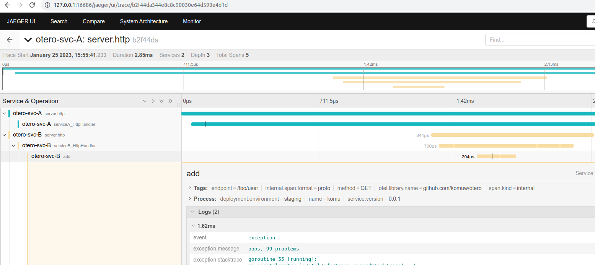
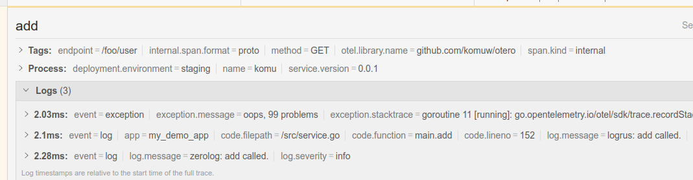

`otero` is a sample app that has logs, traces and metrics integrated together.                  

start;            
`docker-compose up --build`                
Make some requests;             
`curl -vkL http://127.0.0.1:8081/serviceA`                
Access jaeger to check on traces:              
(localhost:16686/jaeger)[http://127.0.0.1:16686/jaeger]             
Notice that, not only do logs have traceId and spanID                
```sh
{
    "app":"my_demo_app",
    "message":"serviceA called",
    "severity":"info",
    "spanId":"d15e62868fccb2bf",
    "traceId":"65dfaa69df19a385095e7e31a812091e",
    "timestamp":"2023-01-21T16:34:05.104073453Z"}
```
But also the traces have logs;               
                     

Access prometheus to check on metrics:                  
(localhost:9090/graph)[http://127.0.0.1:9090/graph]                            
                   

We also added integration of tracing and logs for both logrus and zerolog;     
```sh
{
    "level":"info",
    "app":"my_demo_app",
    "time":"2023-01-27T07:09:58.444782364Z",
    "caller":"/src/service.go:155",
    "traceId":"034456796123896d2b132c932b197dea",
    "spanId":"025f0abd50248e15",
    "message":"zerolog: add called."
}

{
    "app":"my_demo_app",
    "file":"/src/service.go:152",
    "func":"main.add",
    "message":"logrus: add called.",
    "severity":"info",
    "traceId":"6280224dcd81df78ca9a262370c730eb",
    "spanId":"674e48ff133273fa",
    "timestamp":"2023-01-27T07:09:59.153752332Z",
}
```
  
