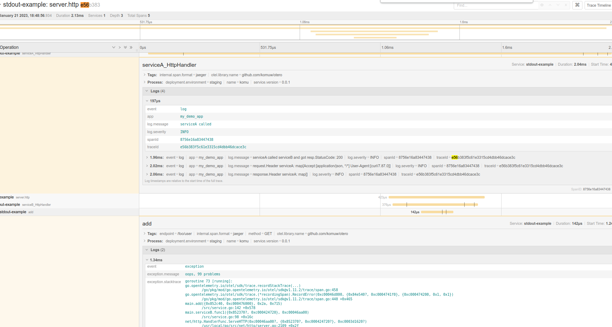

`otero` is a sample app that has logs, traces and metrics integrated together.

start;       
`docker-compose up --build`       
Make some requests;       
`curl -vkL http://127.0.0.1:8081/serviceA`       
Access jaeger to check on traces:       
(http://127.0.0.1:16686/jaeger)[http://127.0.0.1:16686/jaeger]       
Notice that, not only do logs have traceId and spanID        
But also the traces have logs;

