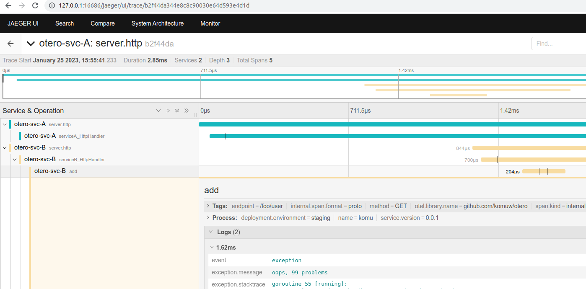
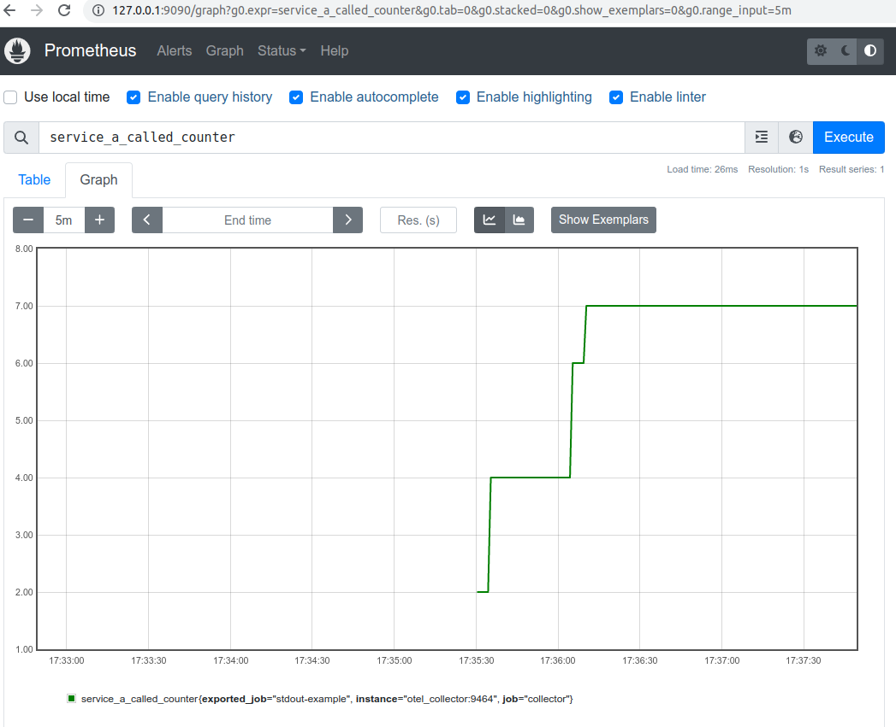
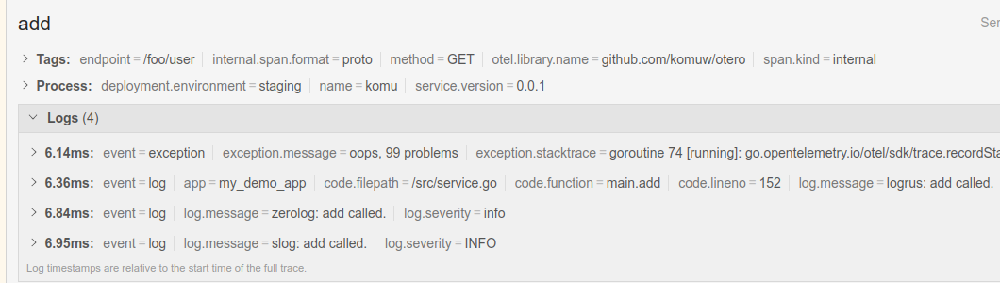

`otero` is a sample app that has logs, traces and metrics integrated together.                  

start;            
`docker-compose up --build`                
Make some requests;             
`curl -vkL http://127.0.0.1:8081/serviceA`                
Access jaeger to check on traces:              
[localhost:16686/jaeger](http://127.0.0.1:16686/jaeger)            
Notice that, not only do logs have traceId and spanID                
```sh
{
    "app":"my_demo_app",
    "message":"serviceA called",
    "severity":"info",
    "spanId":"d15e62868fccb2bf",
    "traceId":"65dfaa69df19a385095e7e31a812091e",
    "timestamp":"2023-01-21T16:34:05.104073453Z"}
```
But also the traces have logs;               
                     

Access prometheus to check on metrics:                  
[localhost:9090/graph](http://127.0.0.1:9090/graph)                            
                   


We also added integration of tracing and logs for both [https://github.com/sirupsen/logrus](logrus), [https://github.com/rs/zerolog](zerolog) & [https://pkg.go.dev/golang.org/x/exp/slog](slog);     
```sh
{
    "time":"2023-01-27T07:09:58.444782364Z",
    "level":"info",
    "app":"my_demo_app",
    "caller":"/src/service.go:155",
    "message":"zerolog: add called."
    "traceId":"034456796123896d2b132c932b197dea",
    "spanId":"025f0abd50248e15",
}

{
    "timestamp":"2023-01-27T07:09:59.153752332Z",
    "severity":"info",
    "app":"my_demo_app",
    "file":"/src/service.go:152",
    "func":"main.add",
    "message":"logrus: add called.",
    "traceId":"6280224dcd81df78ca9a262370c730eb",
    "spanId":"674e48ff133273fa"
}

{
    "time":"2023-01-27T08:34:42.805542202Z",
    "level":"INFO",
    "app":"my_demo_app",
    "source":"/src/service.go:158",
    "msg":"slog: add called.",
    "app":"my_demo_app",
    "traceId":"1cdc62f79dc4b25065f872a95047ab37",
    "spanId":"ea1c18556211039c"
}
```
  
